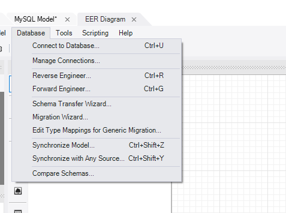

## 1

SELECT \* FROM city WHERE population > 100000 AND countrycode = USA;
-> wrong - USA isn't in inverted comma

SELECT \* FROM city WHERE population > 100000 AND countrycode = 'USA';

## 2

The AS keyword causes errors, so follow this convention: "Select t.Field
From table1 t" instead of "select t.Field From table1 AS t

## 3

SELECT a.id FROM albums a
JOIN bands b ON a.id = b.id
ORDER BY a.id DESC
LIMIT 1,2;

We mustn't use where when we use JOIN.

The WHERE clause might not work as expected in LEFT JOIN or RIGHT JOIN because it can remove rows that the join would normally keep. To avoid this, you should move any filter conditions related to the right (or left) table into the ON clause. This will make sure the join behaves as expected, keeping the rows that should be retained by the outer join.

## 4. UNION vs UNION ALL

The UNION operator combines the result sets of two or more SELECT statements, removing duplicate rows. It returns only distinct rows.

The UNION ALL operator combines the result sets of two or more SELECT statements, including duplicate rows. It returns all rows, including duplicates.

## 5. While creating and droping

CREATE DATABASE IF NOT EXISTS college;

DROP DATABASE IF EXISTS company;

use -> IF NOT EXISTS/ IF EXISTS

## 6. Primary key pairs

PRIMARY KEY (id,name)

Here name can be same, but combination of id & name will be different

## 7. Group by

We must use group by with aggregate functions

SELECT id, name
FROM albums
GROUP BY name;

-> will throw error

-> When you group by name, SQL needs to know how to handle the id
column because it doesn't know which id to show for each name.

-> In SQL, when you group data, you can only select:

1. Columns that you are grouping by (like name), or

2. Columns that are summarized (like using SUM, COUNT, etc.).

SELECT id, name
FROM albums
GROUP BY id, name;

SELECT MIN(id) AS id, name
FROM albums
GROUP BY name;

## 8. General Order

1. SELECT column(s)

   FROM tableName

   WHERE condition

   GROUP BY column(s)

   HAVING condition

   ORDER BY column(s) DESC;

2. UPDATE tableName

   SET col1=val1,col2=val2

   WHERE condition;

3. ALTER TABLE tableName

   ADD COLUMN columnName dataType;

4. ALTER TABLE tableName

   DROP COLUMN columnName ;

5. ALTER TABLE tableName

   RENAME TO newTableName;

6. ALTER TABLE test
   CHANGE COLUMN oldName newName dataType;

7. ALTER TABLE test
   MODIFY columnName dataType;
8. TRUNCATE TABLE table_name;

## 9. Safe mode

To prevent changes by mistake in database

SET SQL_SAFE_UPDATES = 0;
-> off

SET SQL_SAFE_UPDATES = 0;
-> on

## 10. Get table diag how related to each other through ER diag

Select Reverge Engineer

and Then select your database

## A case in sub query

SELECT MAX(name)

FROM (SELECT \* FROM albums WHERE release_year=2025) as temp;

-> we need to use alias when we use sub query in FROM
